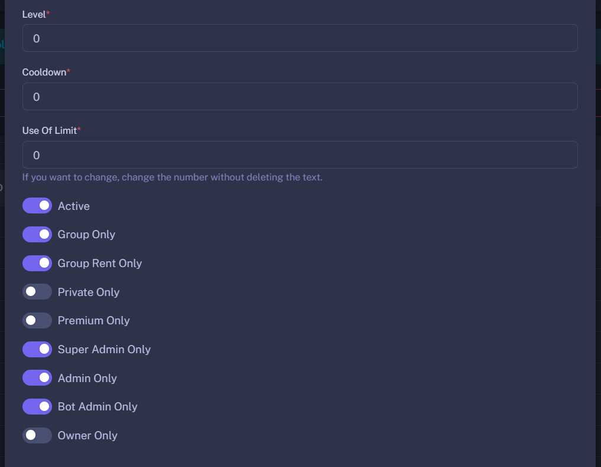

Pada halaman **command** terdapat bagian yang bernama **edit command**, pada artikel ini akan dijelaskan mengenai beberapa opsi yang ada di dalamnya

### 1. Level
Sesuai angka yang telah diatur, jika angka tersebut adalah 2 maka perintah tersebut hanya bisa digunakan ketika level pengguna mencapai level 2 atau lebih. Namun jika diatur ke 0, maka tidak perlu menggunakan sistem levelling untuk menggunakan perintah
> Untuk meningkatkan level bisa dengan memenangkan game atau memperbanyak interaksi

### 2. Cooldown
Cooldown atau bisa disebut delay, delay agar bot merespon perintah tersebut. Atur dalam format detik

### 3. Use Of Limit
Beberapa perintah sudah diatur secara default, misalnya **Use Of Limit** adalah 2, maka setiap penggunaan perintah akan menggunakan 2 limit.
Limit itu sendiri ada 3 macam *Usage*, *Game*, *AI* fungsinya sesuai nama. Jika ingin mengatur agar menggunakan **Limit AI** maka akhiri angka tersebut dengan kata **AI** misalnya **10 AI**

### 4. Active
Untuk menyalakan atau mematikan perintah, hanya owner saja yang bisa mengakses

### 5. Group Only
perintah hanya dapat diakses dalam grup chat saja

### 6. Group Rent Only
perintah hanya dapat berfungsi di grup dan status grup tersebut adalah menyewa

### 7. Private Only
Perintah hanya dapat berfungsi ketika dalam private chat saja

### 8. Premium Only
Perintah tersebut hanya berfungsi untuk pengguna premium saja

### 9. Super Admin Only
Perintah tersebut hanya berfungsi oleh super admin saja, Super Admin biasanya adalah si pembuat grup

### 10. Admin Only
Perintah tersebut hanya dapat diakses oleh member dengan status admin

### 11. Bot Admin Only
Perintah tersebut akan berfungsi ketika Bot menjadi admin

### 12. Owner Only
Perintah tersebut hanya dapat diakses oleh Owner Bot