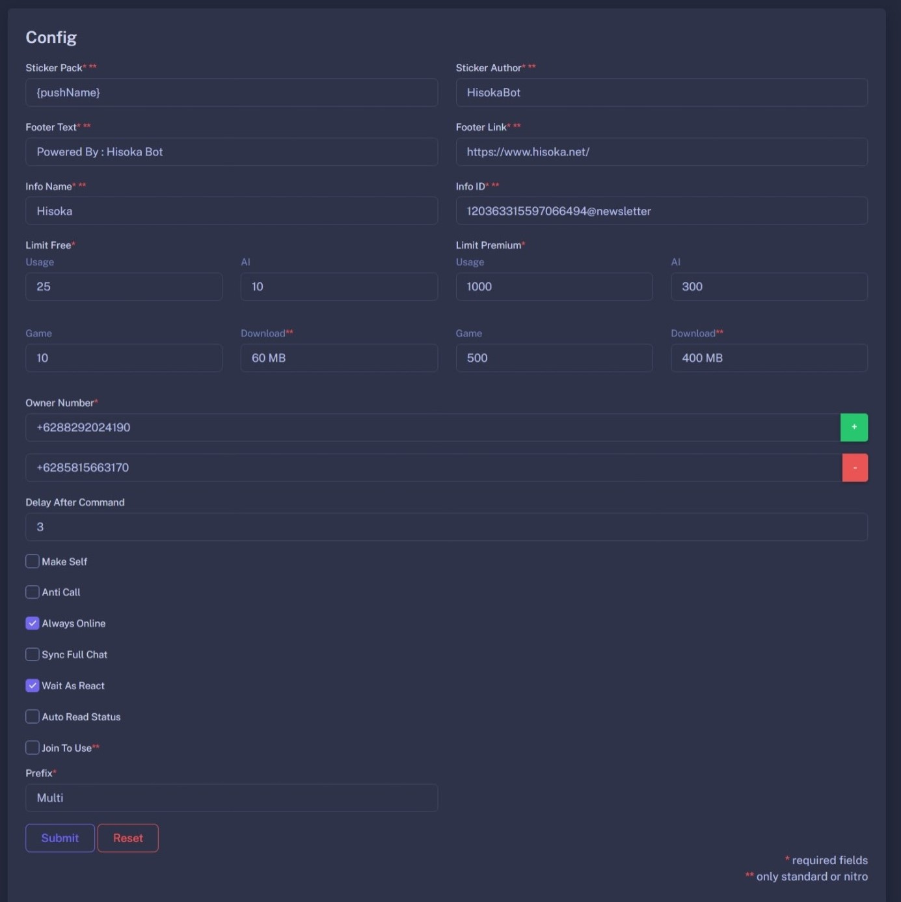

Pada halaman **configuration** kamu dapat mengubah pack sticker, id channel, footer, Limit, Owner, dan lainnya.

Penjelasan singkat mengenai fungsi dari konfigurasi diatas

### Sticker Pack dan Sticker Author

`{pushName}` berfungsi untuk mengambil nama dari peminta atau pengirim perintah.

### **Footer Text** dan **Footer Link**
</img>
Link preview yang tertera pada gambar adalah **Footer Link** dan **Footer Text** adalah deskripsinya

### **Info Name** dan **Info ID**
Ini memiliki fungsi yang mirip dengan **Footer Text** dan **Footer Link**
  
Text berwarna biru yang bertuliskan **Hisoka** adalah **Info Name**, dan ketika kamu menekannya kamu akan diarahkan ke channel atau saluran yang kamu atur di **Info ID**.

### Limit
Limit berfungsi untuk membatasi penggunaan wajar untuk pengguna Bot kamu, atur sesuai plan yang telah disediakan, kamu bisa menyewakan ulang bot kamu dan memperjualbelikan plan premium

### Owner Number
Nomor owner yang akan mengatur bot kamu dan menjadi rujukan ketika seseorang ingin menyewa atau membeli premium

### Make Self
Buat botmu menjadi self, artinya bot hanya bisa digunakan oleh owner saja

### Anti Call
Sesuai nama, berfungsi untuk menolak panggilan yang masuk

### Always Online
Mematikan info **Online** ketika bot sudah terkoneksi

### Sync Full Chat
Untuk memuat semua chat saat kamu baru saja menyambungkan bot, pesan sebelum bot terkoneksi akan dimuat ulang. Rekomendasi untuk mencegah **Menunggu Pesan** namun akan menjadi sedikit lambat.

### Wait As React
Notifikasi memproses eksekusi perintah berupa reaksi emoji

### Auto Read Status
Sesuai nama, berfungsi untuk membaca status
  
Selain itu kamu juga akan disajikan **Auto React Status** yang akan aktif ketika kamu mengatur emoji setelah fungsi **Auto read Status** dinyalakanm pisahkan emoji dengan koma (,)
  
Kamu juga bisa melakukan backup status ke Bot telegram dengan mengatur [**telegram bot token**](https://t.me/BotFather) dan [**telegram user id**](https://t.me/getmyid_bot)

### Join To Use
Bot akan menyuruh pengguna yang belum bergabung ke grup yang telah diatur untuk masuk terlebih dahulu, kamu bisa mengatur agar hanya aktif hanya di chat private saja atau aktif di semua chat, secara default akan aktif hanya di chat pribadi.