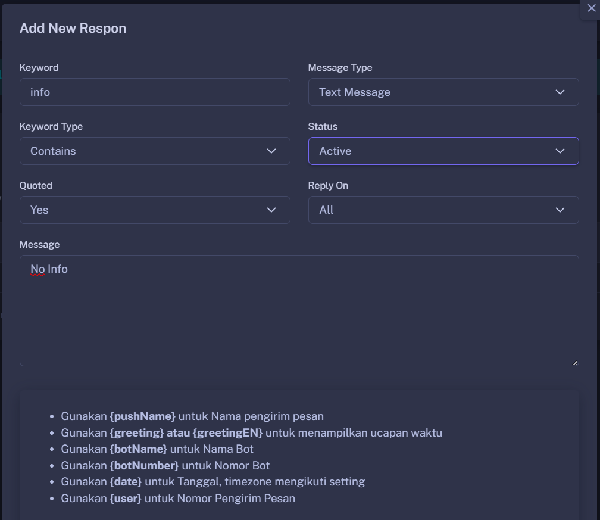

Hisoka menyediakan fitur Auto Responder yang dirancang untuk membantu pengguna memenuhi berbagai kebutuhan, baik untuk pribadi, bisnis, atau konteks lainnya. Dengan fitur ini, Kamu dapat mengatur balasan otomatis dengan tipe pesan yang beragam, seperti:

- 📄 Text Message: Kirim balasan berupa teks yang dapat disesuaikan.
- 📷 Media Message: Balas otomatis dengan gambar, video, atau file media lainnya.
- 📍 Location Message: Bagikan lokasi bisnismu dengan mudah.
- 🗑️ Delete Message: Otomatis menghapus pesan tertentu untuk menjaga kebersihan grup atau chat.
- 📌 Pin Message: Sematkan pesan penting di grup secara otomatis.

Dengan fleksibilitas tipe pesan ini, Layanan Hisoka membantu kamu mengelola komunikasi secara efisien sesuai kebutuhan dan gaya Anda. Cocok untuk meningkatkan produktivitas, manajemen grup, atau bahkan promosi bisnis!

