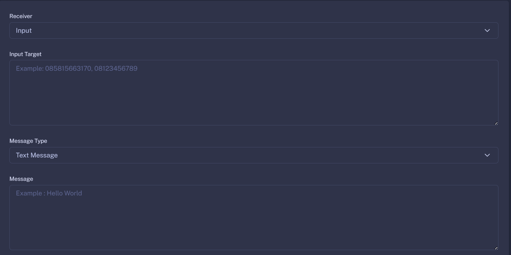

Fitur ini berfungsi untuk mengirim pesan massal atau bulk message. Dengan menggunakan fitur ini, kamu dapat mengirim pesan yang sama ke banyak penerima sekaligus, menghemat waktu dan usaha dibandingkan mengirim pesan satu per satu. Fitur ini sangat berguna dalam berbagai situasi, seperti mengirim pengumuman, pemberitahuan, atau informasi penting kepada sekelompok besar orang.

Kamu bisa mengatur siapa saja yang dapat menerima pesan yang kamu atur
1. Input Number
2. All Contact
3. Select Contact
4. All Group
5. Select Group
6. Community

Dan Hisoka juga mendukung beberapa tipe pesan, seperti
1. Text Message (Default)
2. Media Message (Image, Video, Document, View Once, Sticker, Gif)
3. Location Message

