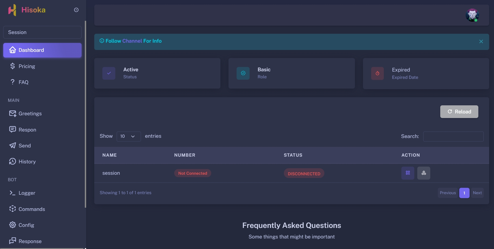

Gambaran halaman dashboard ada di bawah ini:

Untuk memulai bot baru, sebaiknya kamu mengatur konfigurasi bot dengan menekan ikon seperti segitiga pada kolom **Action**
Setelah kamu menekannya, kamu akan mendapati kolom berupa
1. Name - Nama Bot
2. WhatsApp Number - Nomor WhatsApp untuk login bot melalui pairing
3. Webhook - Bersifat opsional
4. API Key - KEY yang digunakan untuk autentikasi ke API

# Cara menjalankan Bot
Seperti pada gambaran sebelumnya, sebelum membuat bot, sebaiknya kamu mengatur konfigurasi dasar pada bot. Lalu bagaimana cara membuat bot?

1. Klik ikon persegi yang berada pada kolom **Action**
2. Tunggu hingga kamu mendapati Logs **CLICK START SESSION!**
3. Setelah server terhubung, maka klik tombol **START SESSION**
4. Kamu akan mendapati **QR** atau kode dengan jumlah 8 digit, tergantung dengan apa yang kamu pilih sebelumnya