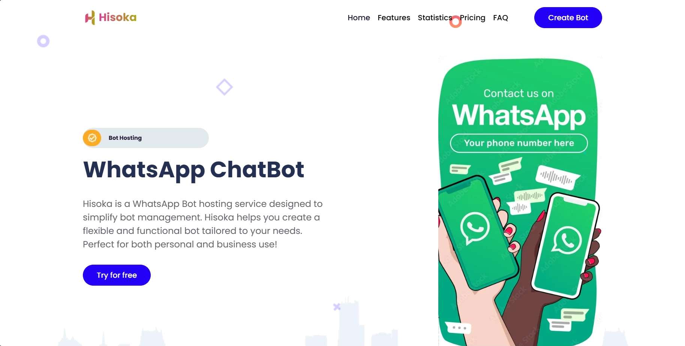
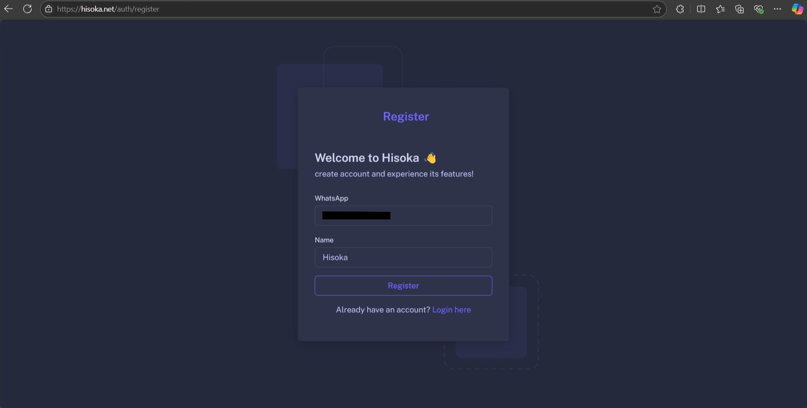
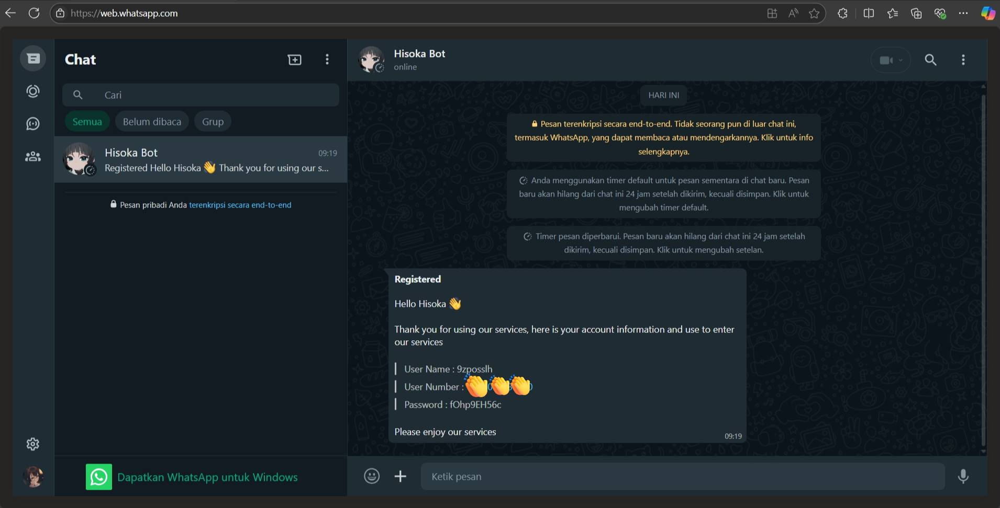
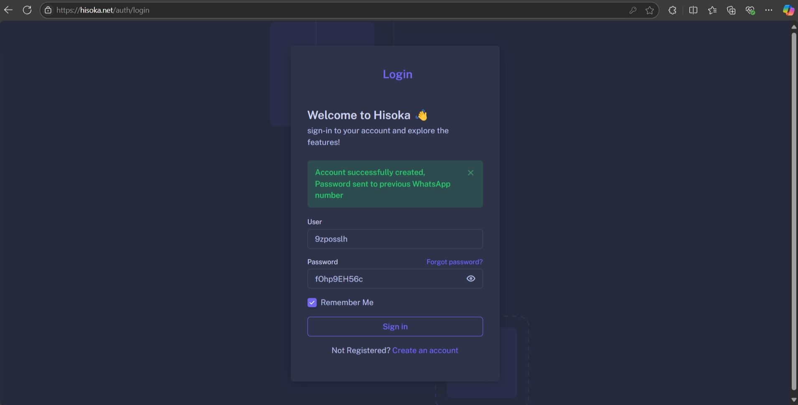

Sebelum Kamu membuat akun di layanan Hisoka, pastikan kamu memiliki Nomor WhatsApp Aktif untuk mendaftar dan menggunakan layanan Hisoka. Nomor ini akan digunakan untuk verifikasi dan sebagai identitas kamu di platform Hisoka.

1. Buka halaman <a href="https://www.hisoka.net">Hisoka</a>

2. Lalu klik button **Try For Free**

3. Isi data dengan benar
Pada halaman pendaftaran, Kamu harus memasukkan nomor WhatsApp dengan format “+62 88…” atau “62888…” dan memasukkan nama sesuai keinginan.

4. Jika sudah, kamu akan mendapati informasi berupa "username" dan "password" yang sudah sistem atur

5. Gunakan data yang sebelumnya bot Notifikasi kirim untuk masuk ke halaman dashboard Hisoka

Jangan lupa untuk mengganti **password** dan **username** yang telah kamu dapatkan